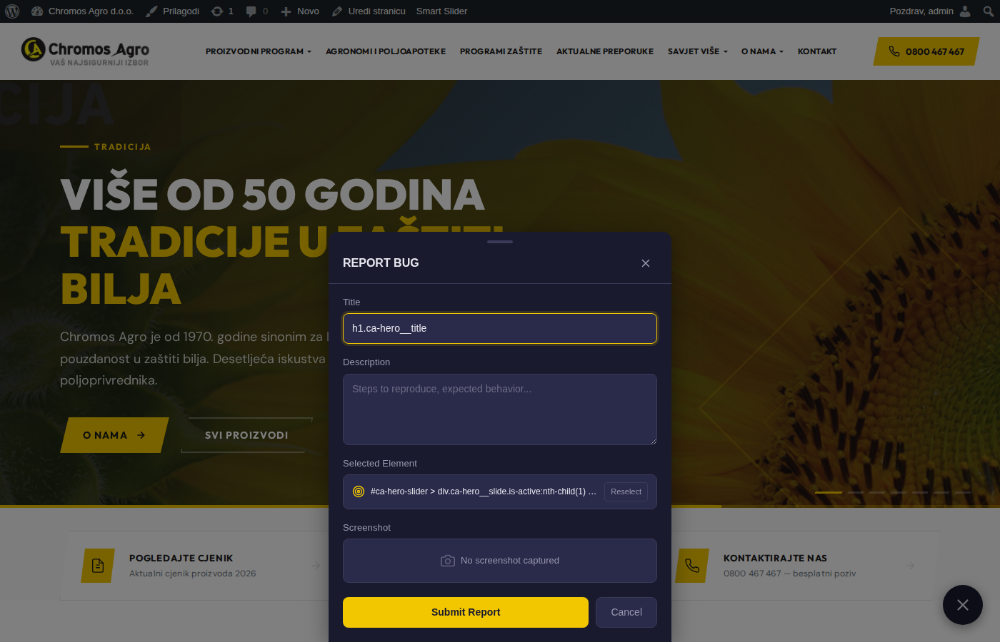
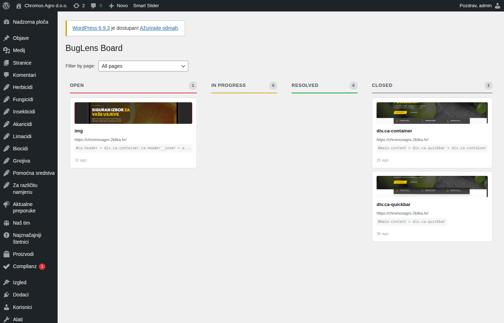
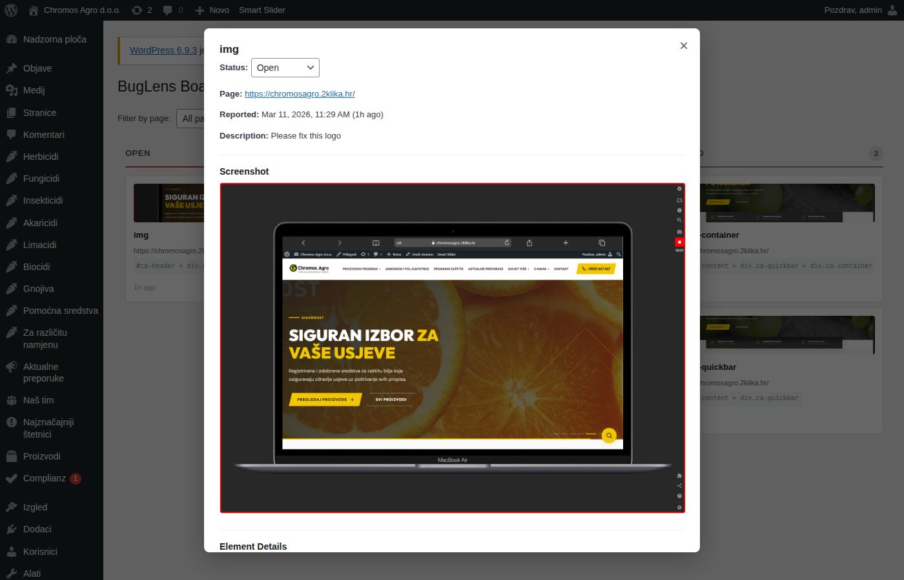
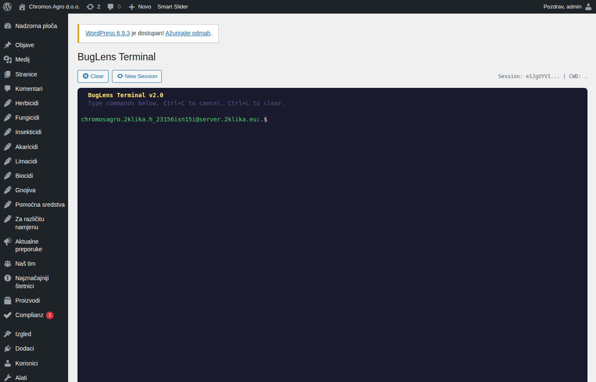
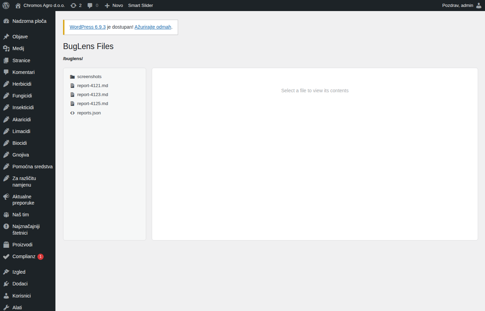
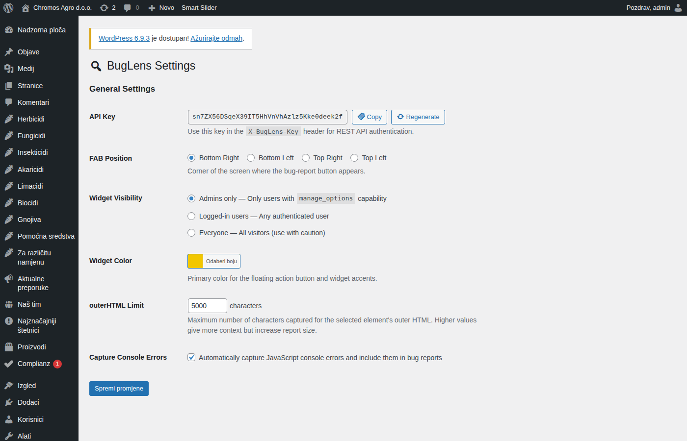

# BugLens – Visual Bug Reporter for AI Agents


**BugLens** is a WordPress plugin that bridges the gap between **visual bug reporting** and **AI-powered development workflows**. Users visually select any element on a page, capture a screenshot, and BugLens generates structured bug reports optimized for AI coding agents (Claude, GPT, Cursor, Copilot, etc.).

Instead of vague descriptions like *"the button looks weird"*, BugLens captures the exact CSS selector, computed styles, bounding box, DOM context, console errors, and a screenshot — everything an AI agent needs to understand and fix the issue without guessing.

---

## Screenshots

### Frontend Widget — Floating Action Button
The golden bug icon appears on your site (configurable corner). Only visible to users you choose (admins, logged-in, or everyone).


### Element Selector Mode
Click the FAB to enter selector mode. Hover over any element — BugLens highlights it and shows its tag/class. Click to select.


### Bug Report Form
After selecting an element, a slide-up form captures the title, description, and all technical data automatically. One click to submit.



### Admin Kanban Board
All bug reports in a drag-and-drop board. Four columns: Open, In Progress, Resolved, Closed. Filter by page URL.



### Report Detail Modal
Click any card for the full picture: screenshot, element selector, computed styles, outerHTML, console errors, bounding box — all the data an AI agent needs.



### Built-in Terminal
A real shell inside WordPress admin (xterm.js). Run quick server commands without switching context. Admin-only with safety warnings.



### File Browser
Browse all exported Markdown reports, JSON index, and screenshots. Edit files with CodeMirror syntax highlighting.



### Settings
Configure the API key, widget position, visibility, color, outerHTML limit, and console error capture.



---

## Real-World Use Cases

### Use Case 1: Solo Developer with Claude Code

> *"I'm building a WordPress site and use Claude Code as my AI assistant. When I spot a visual bug, I click BugLens, select the broken element, and submit. Then I tell Claude: 'Read wp-content/uploads/buglens/report-42.md and fix the bug.' Claude gets the exact selector, styles, HTML, and screenshot — it fixes the issue in one shot instead of going back and forth."*

```bash
# In your Claude Code session:
cat wp-content/uploads/buglens/report-42.md
# Claude now has: selector, computed styles, outerHTML, screenshot path, console errors
# → fixes the CSS/HTML directly
```

### Use Case 2: Client QA Feedback

> *"My client isn't technical but can click a button and describe what's wrong. I set BugLens visibility to 'Everyone' during review, gave the client the staging URL, and asked them to report anything that looks off. Each report comes with a screenshot, the exact element, and computed styles — I don't need to ask 'which button?' or 'what page?' anymore."*

### Use Case 3: Agency Team with AI Workflow

> *"Our QA team uses BugLens on staging sites. Developers use the REST API to pull reports into their AI coding tools. The Kanban board tracks status. When a bug is fixed, drag it to 'Resolved'. No Jira tickets for CSS issues anymore."*

```bash
# Pull all open bugs via API
curl -H "X-BugLens-Key: YOUR_KEY" \
  "https://staging.example.com/wp-json/buglens/v1/reports?status=open"

# Feed to AI agent
for id in 101 102 103; do
  curl -s -H "X-BugLens-Key: YOUR_KEY" \
    "https://staging.example.com/wp-json/buglens/v1/reports/$id"
done
```

### Use Case 4: Debugging CSS/JS Issues

> *"A page had a weird layout shift but only on mobile. I opened it on my phone, used BugLens to select the broken element, and it captured the viewport size (375x667), computed styles (including the problematic `position: fixed`), and a console error about a missing font. I fed the report to Claude and the fix was immediate."*

### Use Case 5: Onboarding New Developers

> *"When onboarding a new developer, I tell them: 'Install BugLens, browse the site, report anything that looks off.' They don't need to know how to inspect elements or write CSS selectors. BugLens captures everything automatically, and I review reports on the Kanban board."*

---

## Why BugLens?

| Traditional Bug Report | BugLens Report |
|---|---|
| "The button is broken" | `button.cta-primary` at `x:450 y:680 200x48px` |
| "It looks weird on mobile" | Viewport `375x667`, computed `font-size: 12px`, `overflow: hidden` |
| "There's an error somewhere" | `TypeError: Cannot read 'addEventListener'` at line 42 |
| "I think it's on the contact page" | `https://example.com/contact/#form-section` |
| *Screenshot from phone camera* | Clean PNG with element highlighted, full page context |
| "The color seems off" | `color: #333`, `background: rgba(0,0,0,0.8)`, `opacity: 0.5` |

---

## Features

### Frontend Widget
- **Visual element selector** — hover over any element to see its tag and classes, click to select
- **Automatic screenshot capture** — uses html2canvas to capture the viewport with the selected element highlighted
- **Console error capture** — automatically collects JavaScript errors that occurred on the page
- **Smart context detection** — detects if the selected element is inside a modal, popover, dropdown, or other overlay
- **Floating action button (FAB)** — configurable position (4 corners) and color
- **Visibility controls** — show to admins only, logged-in users, or everyone
- **Fully self-contained** — vanilla JS, no jQuery, no build step, no external dependencies
- **Responsive** — works on mobile and desktop
- **Accessibility** — keyboard navigable, respects `prefers-reduced-motion`

### Admin Dashboard
- **Kanban board** — drag-and-drop bug reports between status columns (Open, In Progress, Resolved, Closed)
- **Detail modal** — click any card to see the full report with screenshot, element details, computed styles, outerHTML, console errors
- **Page filter** — filter reports by the page URL they were reported on
- **Delete reports** — with confirmation, removes report, screenshot, and export files

### Built-in Terminal
- **Web-based terminal** — full shell access via xterm.js in the WordPress admin
- **Session management** — persistent CWD across commands, 15-minute timeout
- **History** — arrow keys navigate command history
- **Safety** — warning dialog on first use, requires explicit acceptance

### File Browser
- **Browse export files** — tree view of all BugLens export files (Markdown reports, JSON index, screenshots)
- **CodeMirror editor** — syntax-highlighted editing of text files
- **Image preview** — inline preview of screenshots
- **Download** — download any file directly
- **Path-safe** — all file operations are sandboxed to the BugLens uploads directory

### REST API
```
GET    /wp-json/buglens/v1/reports              — list reports (paginated, filterable)
POST   /wp-json/buglens/v1/reports              — create report (with metadata + screenshot)
GET    /wp-json/buglens/v1/reports/{id}          — get full report details
PATCH  /wp-json/buglens/v1/reports/{id}          — update status
DELETE /wp-json/buglens/v1/reports/{id}          — delete report
GET    /wp-json/buglens/v1/reports/{id}/screenshot — get screenshot URL
```
Authentication: `X-BugLens-Key` header (API key) or WordPress admin session (nonce).

### Export System
- **Markdown reports** — each report auto-exported as `.md` in `wp-content/uploads/buglens/`
- **JSON index** — `reports.json` with all report metadata and file paths
- **AI-ready** — format designed to be directly included in AI agent prompts

---

## How It Works

### Step 1: Report a Bug

1. Click the floating bug icon (FAB) on any page
2. The page enters **selector mode** — hover over elements to highlight them
3. Click an element to select it
4. A slide-up form appears with pre-filled element info + screenshot
5. Add a title and description, then submit

### Step 2: Manage on Kanban Board

1. Go to **BugLens > Board** in WordPress admin
2. See all reports organized by status
3. Drag cards between columns to update status
4. Click a card for full details

### Step 3: Feed to Your AI Agent

Bug reports are automatically exported as Markdown files:

```bash
# Read the index
cat wp-content/uploads/buglens/reports.json

# Read a specific report — feed this to your AI agent
cat wp-content/uploads/buglens/report-42.md
```

Or use the REST API:

```bash
curl -H "X-BugLens-Key: YOUR_API_KEY" \
  https://yoursite.com/wp-json/buglens/v1/reports/42
```

#### Example Report Output

```markdown
# BugLens Report #42

| Field | Value |
|-------|-------|
| Status | open |
| Page | https://yoursite.com/contact/ |
| Browser | Chrome/122.0 |
| Viewport | 1920x1080 |

## Target Element
- **Selector:** `form.contact-form > button.submit-btn`
- **Parent chain:** `body > main > section.contact > form > button`
- **Bounding box:** x:450, y:680, 200x48

## Description
Submit button doesn't change color on hover. Expected: green hover state.

## Console Errors
[0] TypeError: Cannot read properties of undefined (reading 'addEventListener')
```

---

## Installation

### From WordPress.org (recommended)

1. In WordPress admin, go to **Plugins > Add New**
2. Search for "BugLens"
3. Click **Install Now**, then **Activate**

### From GitHub

1. Download the [latest release](https://github.com/dd-jfranjic/buglens/releases)
2. In WordPress admin, go to **Plugins > Add New > Upload Plugin**
3. Upload the ZIP and activate

### Manual

```bash
cd /path/to/wordpress/wp-content/plugins/
git clone https://github.com/dd-jfranjic/buglens.git
```

### Requirements

- WordPress 6.0+
- PHP 8.0+

---

## Configuration

After activation, go to **BugLens > Settings**:

| Setting | Description | Default |
|---------|-------------|---------|
| **API Key** | Auto-generated 40-char key for REST API auth. Can be regenerated. | Auto |
| **FAB Position** | Corner of screen for the floating button | Bottom Right |
| **Widget Visibility** | Who sees the bug report widget | Admins only |
| **Widget Color** | Primary color for the FAB and accents | `#F2C700` |
| **outerHTML Limit** | Max characters captured for element HTML | 5000 |
| **Console Errors** | Auto-capture JS console errors | Enabled |

---

## Data Captured Per Report

| Data | Description |
|------|-------------|
| **Title** | User-provided bug title |
| **Description** | User-provided bug description |
| **Page URL** | Full URL where the bug was reported |
| **CSS Selector** | Unique selector for the selected element |
| **Parent Chain** | Full DOM path from body to the element |
| **outerHTML** | The element's HTML (truncated to configured limit) |
| **Inner Text** | Text content of the element |
| **Computed Styles** | Key CSS properties (color, font, display, position, etc.) |
| **Bounding Box** | Element's position and dimensions on screen |
| **Viewport** | Browser viewport dimensions |
| **Browser** | Full user agent string |
| **Console Errors** | JavaScript errors captured on the page |
| **Screenshot** | PNG screenshot with element highlighted |
| **Context** | Whether element is on-page or inside an overlay/modal |
| **Status** | open, in_progress, resolved, closed |

---

## Plugin Structure

```
buglens/
├── buglens.php                    # Main plugin file
├── uninstall.php                  # Clean removal of all data
├── includes/
│   ├── class-buglens-cpt.php      # Custom Post Type + meta fields
│   ├── class-buglens-rest-api.php # REST API (CRUD + screenshot)
│   ├── class-buglens-export.php   # Markdown + JSON export
│   ├── class-buglens-widget.php   # Frontend widget loading
│   ├── class-buglens-admin.php    # Admin menus, settings, assets
│   ├── class-buglens-terminal.php # Web terminal (proc_open)
│   └── class-buglens-files.php    # File browser (AJAX)
├── admin/
│   ├── css/buglens-admin.css      # Admin styles
│   ├── js/                        # Board, terminal, files, settings JS
│   └── views/                     # PHP templates
├── public/
│   ├── css/buglens-widget.css     # Frontend widget styles
│   └── js/buglens-widget.js       # Frontend widget logic
├── vendor/xterm/                  # xterm.js terminal emulator
└── languages/buglens.pot          # Translation template
```

---

## Security

- **API key auth** — timing-safe `hash_equals()` comparison
- **Nonce verification** — on all AJAX endpoints
- **Capability checks** — `manage_options` required for admin features
- **Input sanitization** — `sanitize_text_field()`, `absint()`, `sanitize_hex_color()`, JSON validation
- **Output escaping** — `esc_html()`, `esc_attr()`, `esc_url()`, `wp_kses()`
- **Path traversal protection** — file operations sandboxed via `realpath()` + prefix check
- **XSS prevention** — safe DOM methods (`textContent`, `createElement`), no `innerHTML`
- **Terminal safeguards** — warning dialog, 15-min session timeout, admin-only

---

## Clean Uninstall

When deleted via WordPress admin, BugLens removes:
- All bug report posts and meta data
- Options (`buglens_api_key`, `buglens_settings`)
- The entire `wp-content/uploads/buglens/` directory

No orphaned data.

---

## Development

### No Build Step Required

Vanilla JavaScript — no React, no webpack, no npm. Edit PHP/JS/CSS directly.

### Coding Standards

- PHP: WordPress Coding Standards (WPCS)
- CSS: BEM naming with `buglens-` prefix
- JS: Vanilla ES5-compatible, no transpilation
- i18n: All strings wrapped in `__()` / `esc_html__()`

### Generate POT File

```bash
wp i18n make-pot ./buglens ./buglens/languages/buglens.pot --domain=buglens
```

---

## License

GPL v2 or later. See [LICENSE](LICENSE).

---

## Credits

Built by [2klika](https://2klika.hr) for AI-assisted WordPress development workflows.

**Third-party libraries:**
- [xterm.js](https://xtermjs.org/) v6.0.0 — Terminal emulator (MIT License)
- [html2canvas](https://html2canvas.hertzen.com/) — Screenshot capture (loaded from CDN, MIT License)
